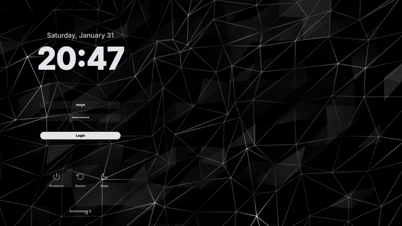

<div align="center">

# **_Thyx_**

<br/>
<p align="center">
  <a href="https://github.com/rccyx/thyx/actions/workflows/ci.yml">
    
  </a>
  <a href="#installation">
    
  </a>
  <a href="https://github.com/rccyx/thyx">
    
  </a>
  <a href="https://github.com/rccyx/thyx/releases">
    
  </a>
  <a href="https://github.com/rccyx/thyx/blob/main/LICENSE">
    
  </a>
</p>

</div>

## Preview


### Presets

Ships with 4 full visual systems.

Each one is a complete [preset](/presets/) with its own palette and [wallpaper](/wallpapers/).

Fully configurable, so you can also [create your own](#creating-your-own).

|                                                             **Gilded**                                                              |                                                             **Blush**                                                              |
| :---------------------------------------------------------------------------------------------------------------------------------: | :--------------------------------------------------------------------------------------------------------------------------------: |
|  |  |

|                                                             **Malachite**                                                              |                                                             **Sakura**                                                              |
| :------------------------------------------------------------------------------------------------------------------------------------: | :---------------------------------------------------------------------------------------------------------------------------------: |
|  |  |

### Dynamic backgrounds

But of course.



<details>
<summary><strong>Supported formats and guidelines</strong></summary>

<br/>

Video files can be used anywhere a background image is accepted and are rendered as full-screen, looped, ambient backgrounds.

#### Supported formats

- `mp4` (recommended)
- `webm`
- `mkv`
- `mov`
- `m4v`
- `avi`

For maximum compatibility and reliability, **H.264-encoded MP4** is strongly recommended.

#### For best results

- Keep videos short (~6–10 seconds)
- No audio
- Prefer 720p or 1080p
- Designed to loop seamlessly

</details>

> [!IMPORTANT]
> It **does not** ship **video assets** by default. You're free to use **your own** video files.

## Guide

Want a fast mental model of what this is, what SDDM is, what it changes, and how recovery works? Check out the [guide](./docs/guide.md).

## Installation

Clone the repo, then run the installer from the repo root.

```bash
git clone https://github.com/rccyx/thyx.git
cd thyx
./scripts/install
```

For non interactive installs, pass `--yes`.

```bash
./scripts/install --yes
```

The installer will install and setup everything for the following (through the manifests in [`scripts/data`](./scripts/data/)):

- **Debian**
  - Bookworm
  - Trixie
  - Forky
  - Sid

- **Ubuntu**
  - Jammy / 22.04
  - Noble / 24.04
  - Resolute / 26.04

  - **Linux Mint**
  - **Pop!\_OS**
  - **Zorin**

  - **Arch**
  - **Fedora**
  - **openSUSE Tumbleweed**
  - **Alpine Edge**
  - **Gentoo**

If you use another distro, have a look at the generic [package contract](/scripts/data/deps.generic) and map it through your package manager.

The installer is local, explicit, and idempotent. It validates the theme tree, installs missing runtime packages, checks required commands, stages the install atomically, writes the SDDM theme selection, and keeps the current session alive.

During setup, it prints the exact plan, asks for confirmation and sudo, installs end to end, and logs the run.

<details>
<summary><strong>What the installer does</strong></summary>

<br/>

It runs in this order.

1. finds the Thyx repo from the script path or current directory
2. detects the distro
3. selects the matching package manifest from [`scripts/data/deps.map`](./scripts/data/deps.map)
4. installs missing runtime packages from the selected manifest
5. verifies required shell commands, the SDDM greeter, runtime packages, and `fc-cache` when bundled fonts exist
6. prints the install plan
7. asks for confirmation and sudo
8. removes the previous fixed stage path at `/usr/share/sddm/themes/.thyx.stage` if exists
9. removes the previous fixed rollback path at `/usr/share/sddm/themes/.thyx.previous` if exists
10. creates a fresh stage directory at `/usr/share/sddm/themes/.thyx.stage`
11. copies the repo into the stage directory with `rsync --delete`
12. strips repo-only files from the staged install:
    - `.git/`
    - `.github/`
    - `justfile`
    - `.qmllint.ini`

13. validates the staged theme before activation
14. moves an existing `/usr/share/sddm/themes/thyx` to `/usr/share/sddm/themes/.thyx.previous` during activation
15. moves `/usr/share/sddm/themes/.thyx.stage` into `/usr/share/sddm/themes/thyx`
16. validates the activated theme
17. restores `/usr/share/sddm/themes/.thyx.previous` if activation or validation fails
18. removes `/usr/share/sddm/themes/.thyx.previous` after a successful activation
19. installs bundled fonts into `/usr/local/share/fonts/thyx`
20. refreshes the font cache
21. backs up `/etc/sddm.conf` once to `/etc/sddm.conf.thyx-back` when an existing config is present
22. writes `Current=thyx` under `[Theme]` in `/etc/sddm.conf`
23. enables SDDM when `systemctl` exists
24. verifies the installed theme, selected SDDM theme, metadata, config file, and fonts
25. prints a safe greeter test command
26. logs everything to `~/.cache/thyx/thyx-install-*.log`

After installation, the theme is at `/usr/share/sddm/themes/thyx`. This is where SDDM loads it from.

The same install can be done manually by following the same steps.

</details>

## Uninstallation

Thyx comes off as clean as if… **it never got in.**

Ships with a first-class [uninstall](/scripts/uninstall) script so you don’t brick your login screen or get left hanging.

It logs everything and prints a plan before proceeding.

Run it from the repo.

```bash
./scripts/uninstall
```

For non-interactive uninstall:

```bash
./scripts/uninstall --yes
```

<details>
<summary><strong>What the uninstaller does</strong></summary>

<br/>

It runs in this order.

- validates the repo tree
- verifies required uninstall commands
- prints a plan before touching anything
- asks for confirmation and sudo
- restores `/etc/sddm.conf` from `/etc/sddm.conf.thyx-back` when that backup exists
- otherwise removes `Current=thyx` from `/etc/sddm.conf`
- removes:
  - `/usr/share/sddm/themes/thyx`
  - `/usr/share/sddm/themes/.thyx.stage`
  - `/usr/share/sddm/themes/.thyx.previous`
  - `/usr/local/share/fonts/thyx`

- refreshes font cache when fonts were removed
- verifies that Thyx files are gone
- verifies that `/etc/sddm.conf` no longer selects `thyx`
- never restarts SDDM automatically
- logs everything to `~/.cache/thyx/thyx-uninstall-*.log`

</details>

When you’re ready to apply changes, restart SDDM from a TTY:

```bash
sudo systemctl restart sddm
```

> [!WARNING]
> This logs you out!

Or reboot.

## Preview (no logout)

From the repo, run:

```bash
./scripts/preview
```

Runs the SDDM greeter in test mode. Your session is untouched.

Close the window when done (your compositor’s normal close shortcut, for example `Alt+Q` on Hyprland).

### Using a preset

All settings live in `theme.conf`. Edit, preview, repeat.

From `/usr/share/sddm/themes/thyx`, copy any preset config from `presets/` over the main `theme.conf`.

```bash
cp presets/malachite.conf theme.conf
./scripts/preview
```

When satisfied, restart SDDM or reboot.

### Creating your own

You can create custom presets by duplicating an existing preset and modifying it.

```bash
cp presets/gilded.conf presets/my-custom.conf
cp presets/my-custom.conf theme.conf
./scripts/preview
```

Edit freely, keep as many presets as you want, and swap them by copying into `theme.conf`.

### Switching presets via metadata

If you’re already in an editor, you can point SDDM at a preset directly through [`metadata.desktop`](/metadata.desktop).

```ini
[SddmGreeterTheme]
Theme-Id=thyx
ConfigFile=presets/gilded.conf
```

Point `ConfigFile` to any preset in `presets/`.

```ini
ConfigFile=presets/blush.conf
# or
ConfigFile=presets/malachite.conf
# or
ConfigFile=presets/sakura.conf
```

Save the file, then restart SDDM or reboot.

> [!TIP]
> You can wire a shell function or keybinds to switch presets instantly. I personally use `Alt + R` to rotate the login screen and desktop matching themes.

## Fonts

Ships with **Plus Jakarta Sans**, and the installer installs it system wide for SDDM.

The `Font` setting in `theme.conf` must match the font family name exactly as your system registers it.

```ini
Font="Plus Jakarta Sans"
```

Confirm availability:

```bash
fc-list -f "%{family}\n" | grep -i "Plus Jakarta Sans" || true
```

### Switching fonts

If you’ve installed additional fonts on your system, you can instruct the greeter to use a different one by updating the `Font` setting.

To see all available font families:

```bash
fc-list -f "%{family}\n" | sort -u
```

Then replace the `Font` value with the exact family name.

For example, if you have `Inter` already installed:

```ini
Font="Inter"
```

After changing fonts, rebuild the font cache if needed:

```bash
sudo fc-cache -f -v
```

## Configuration guide

All settings are in `theme.conf`. You can safely test edits using [`./scripts/preview`](/scripts/preview) so you don’t get locked out and have to [recover](./docs/guide.md#recovery-protocol) via TTY.

### Basic settings

| Setting                            | Description                                | Example                   |
| ---------------------------------- | ------------------------------------------ | ------------------------- |
| `Font`                             | System font family                         | `"Plus Jakarta Sans"`     |
| `FontSize`                         | Base font size in points                   | `"12"`                    |
| `Background`                       | Wallpaper or video path, relative to theme | `"wallpapers/gilded.jpg"` |
| `AllowUppercaseLettersInUsernames` | Username capitalization behavior           | `"true"`, `"false"`       |

### Time and date display

| Setting      | Description | Options                                       |
| ------------ | ----------- | --------------------------------------------- |
| `HourFormat` | Time format | `"HH:mm"` (24h), `"hh:mm AP"` (12h), `"long"` |
| `DateFormat` | Date format | `"dddd d MMMM"` gives `Thursday 29 August`    |

### Layout and form

| Setting        | Description               | Options                         |
| -------------- | ------------------------- | ------------------------------- |
| `FormPosition` | Login form position       | `"left"`, `"center"`, `"right"` |
| `Blur`         | Background blur intensity | `"0.0"` to `"1.0"`              |

### Animation

| Setting             | Description                     | Options                                 |
| ------------------- | ------------------------------- | --------------------------------------- |
| `AnimationDuration` | Hover or focus transition speed | `"80"`, `"120"`, `"300"`                |
| `AnimationEasing`   | Animation curve                 | `"OutQuart"`, `"OutCubic"`, `"OutBack"` |

### Colors

#### Text colors

- `DateTextColor` - Date display color
- `TimeTextColor` - Time display color
- `LoginFieldTextColor` - Username text
- `PasswordFieldTextColor` - Password text
- `PlaceholderTextColor` - Input placeholder text
- `LoginButtonTextColor` - Login button text
- `EnvironmentButtonTextColor` - Environment selector text
- `SystemButtonsIconsColor` - Power, restart, and sleep button icons and labels

#### Background colors

- `FormBackgroundColor` - Login form background
- `LoginFieldBackgroundColor` - Username input background
- `PasswordFieldBackgroundColor` - Password input background
- `LoginButtonBackgroundColor` - Login button background

#### Dropdown colors

- `DropdownTextColor` - Dropdown menu text
- `DropdownSelectedTextColor` - Selected item text
- `DropdownBackgroundColor` - Dropdown background
- `DropdownSelectedBackgroundColor` - Selected item background
- `DropdownBorderColor` - Dropdown border
- `DropdownSelectedBorderColor` - Selected item border

#### Hover effects

- `HoverLoginButtonBackgroundColor` - Login button on hover
- `HoverSystemButtonsIconsColor` - System buttons on hover
- `HoverEnvironmentButtonTextColor` - Environment button on hover

## Customization examples

### Change form position

```ini
FormPosition="center"
# or
FormPosition="right"
```

### Adjust colors for a dark theme

```ini
DateTextColor="#e0e0e0"
TimeTextColor="#ffffff"
FormBackgroundColor="#1a1a1a"
```

### Speed up animations

```ini
AnimationDuration="50"
AnimationEasing="OutCubic"
```

### Use a video background

```ini
Background="wallpapers/my-video.mp4"
```

Video backgrounds use the same `Background` setting as image backgrounds.

## Automatic fingerprint login

If your system uses PAM fingerprint authentication, it can start fingerprint login as soon as the screen appears.

```ini
AutoFingerprintOnLoad=true
```

When enabled, it automatically calls PAM’s fingerprint check on load and logs in as soon as the scan matches.

If fingerprint isn’t configured or fails, the greeter falls back to password login normally.

> [!IMPORTANT]
> This doesn’t enable fingerprint support itself. PAM must already be configured for fingerprints in `/etc/pam.d/sddm` with `pam_fprintd.so`.

## Issues

Having issues? Read [this](./.github/ISSUES.md).

## License

MIT © @rccyx
